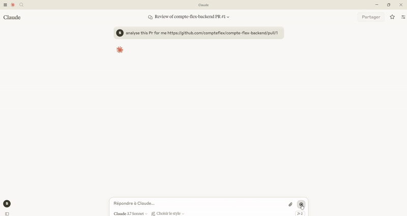
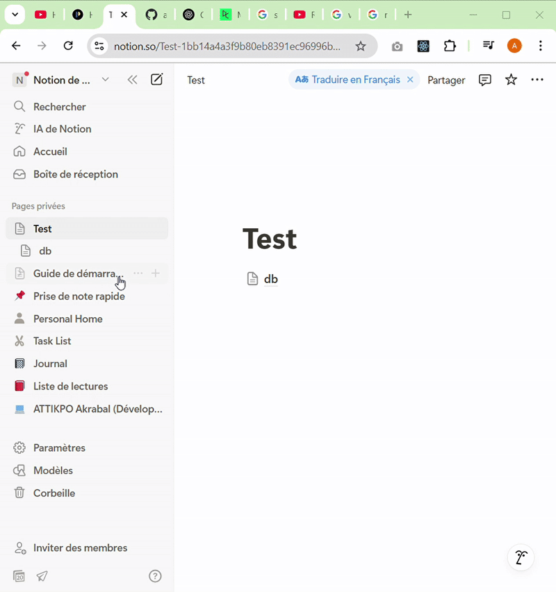

# PR Reviewer

## Description
PR Reviewer is a tool designed to analyze GitHub pull requests and create detailed reports in Notion. It leverages the MCP (Model Context Protocol) to facilitate communication and integration between different services.

## PRE REQUISITES

- MCP https://blog.stackademic.com/model-context-protocol-mcp-in-ai-9858b5ecd9
- Source tuto https://www.datacamp.com/tutorial/mcp-model-context-protocol


## Features
- Fetch changes from GitHub pull requests.
- Create detailed reports in Notion.
- MCP server for handling PR analysis requests.

## Requirements
- Python 3.13 or higher
- MCP CLI
- Notion API key
- GitHub API token

## Installation
1. Clone the repository:
    ```sh
    git clone https://github.com/attikpo-akrabal-godwin/PR-Reviewer.git
    cd pr-reviewer
    ```

2. Create a virtual environment and activate it:
    ```sh
    python -m venv .venv
    source .venv/bin/activate  # On Windows use `.venv\Scripts\activate`
    ```

3. Install the dependencies:
    ```sh
    pip install -r requirements.txt
    ```

4. Create a `.env` file in the project root and add your GitHub and Notion credentials:
    ```env
    GITHUB_TOKEN=your_github_token
    NOTION_API_KEY=your_notion_api_key
    NOTION_PAGE_ID=your_notion_page_id
    NOTION_DATABASE_ID=your_notion_database_id
    ```

## Usage
1. Run the MCP server:
    ```sh
    python pr_anayzer.py
    ```

2. Use the MCP Host (Claude ai) to interact with this MCP server . For example




3. from claude ai you can  create a Notion page with the PR analysis:
   

## Project Structure
- `main.py`: Entry point for the project.
- `pr_anayzer.py`: Contains the `PRAnalyzer` class which initializes the MCP server and registers tools for PR analysis.
- `github_integration.py`: Contains functions to fetch changes from GitHub pull requests.
- `.env`: Environment variables for GitHub and Notion credentials.
- `requirements.txt`: List of dependencies.
- `pyproject.toml`: Project metadata and dependencies.

## License
This project is licensed under the MIT License. See the [LICENSE](LICENSE) file for details.

## Contributing
Contributions are welcome! Please open an issue or submit a pull request for any improvements or bug fixes.

## Contact
For any questions or inquiries, please contact [attikpoakrabal@gmail.com](mailto:attikpoakrabal@gmail.com).